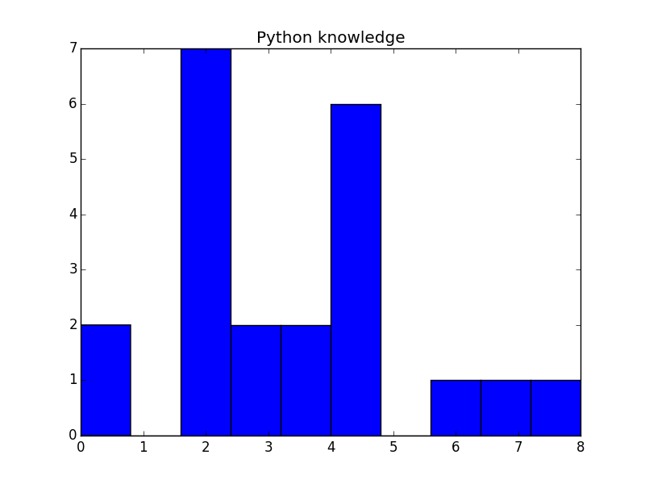

## Introduction

* Quick overview of what we will be doing during the Basic Linux and
  Coding for Astronomy and Astrophysics.
* Small survey + quizz to guage the level of our group. [Download the PDF](pretest.pdf)

### General Quizz Results

### Python specific Quizz Results

### Overall Scores Results

